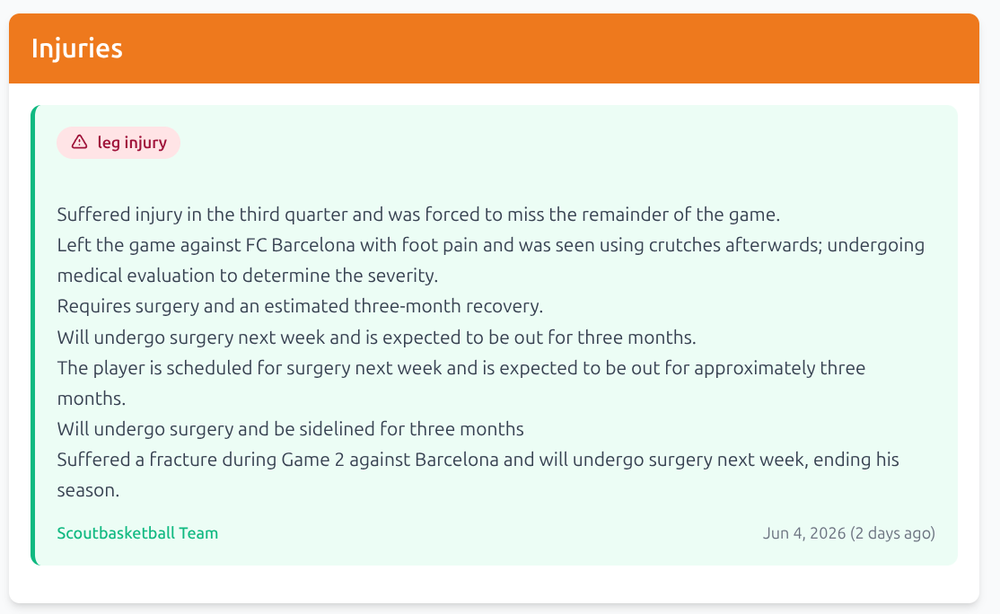

I'm building scout-agent, an AI system that researches basketball players and
writes scouting reports for coaches and sporting directors. I want to document
the whole thing as I go, the dead ends included. This is a dead end.

## The version that made sense at the time

Injuries were the obvious place to start. Most of a scouting report is fairly
stable, but the injury situation can flip overnight, and that's usually the part
a coach checks first. Get that right and the rest can wait.

So I built the simplest thing that could work:

```
read injury blogs  →  pull out the injury sentences  →  add them to the player
```

Run it every day, append whatever's new. A few hours of work and I had something
running.

## Then I read the output



Seven bullet points on one guy. Go through them slowly and you realize they're
all describing the same broken leg: it happened against Barcelona, surgery's
booked for next week, he's looking at roughly three months out, and his season
is over.

One injury. Seven sources each wrote it up a bit differently, and my code
treated every version as a fresh fact and stacked them. What I'd built wasn't an
injury history, it was the same sentence wearing seven outfits.

## What was actually broken

The problem wasn't the scraping. The scraper did its job fine. The problem was
that I'd assumed pulling the text out was most of the work, when really it's
barely the start. To turn those seven lines into something useful, the system
has to notice they're the same event in the first place, work out that
"undergoing evaluation to determine severity" and "ending his season" are the
same story caught at two different moments, and then keep only the version
that's still true. After all that, write the one line worth reading.

None of that is scraping. It's judgment, and a pipeline that just shuttles text
from one step to the next has nowhere to make a judgment call. It does exactly
what you tell it, which here meant faithfully producing nonsense.

## Where this goes next

What I actually need is something that can sit with those seven mentions, decide
they're one event, sanity-check the timeline, and only then write. And when it's
not sure, go look again instead of guessing.

That's an agent, not a pipeline. Next post I'll build the smallest possible
version of one: an LLM that decides, by itself, to reach for a tool.

Repo: [github.com/ricardomm85/scout-agent](https://github.com/ricardomm85/scout-agent)
